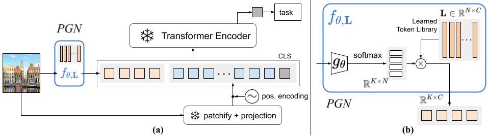

# Prompt Generation Networks for Efficient Adaptation of Frozen Vision Transformers

This repository is the official implementation of [Prompt Generation Networks for Efficient Adaptation of Frozen Vision Transformers](https://arxiv.org/abs/2030.12345) by Jochem Loedeman, Maarten Stol, Tengda Han and Yuki M Asano.



## Requirements

To install python dependencies, make sure that poetry is installed and execute the following in the project root directory:

```setup
poetry install
```
### Data
See [`data/README.md`](data/README.md)

### DINO
Download the full checkpoint for DINO ViT-S/16 from [here](https://github.com/facebookresearch/dino) and insert it as `pgn/pgn_models/dino/dino_deitsmall16_pretrain_full_checkpoint.pth`.

## Training

To train/test with the CLIP backbone, run

```train
poetry run train_clip
poetry run test_clip
```

To train/test with either DINO or supervised ViT, specify the backbone with `--vision_model_type` and run

```train
poetry run train_visionmodel
poetry run test_visionmodel
```

For all available command line arguments, see [`pgn/scripts`](pgn/scripts).

## Pretrained PGNs
Pretrained PGNs are supplied in [`pretrained_pgns/`](pretrained_pgns). To use them in the context of this repository, specify the desired model by setting the `--pgn_path` argument in the test scripts.

# Reference
If you find this repository is useful for your project, please consider citing our paper:
```bibtex
@article{Loedeman2022prompt,
    author       = "Jochem Loedeman and Maarten Stol and Tengda Han and Yuki M Asano",
    title        = "Prompt Generation Networks for Efficient Adaptation of Frozen Vision Transformers",
    journal      = "arxiv preprint arxiv:2030.12345",
    year         = "2022",
}
```
